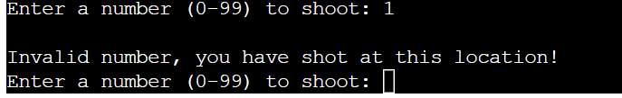

# Solo Battleships Game

[-> Link to live site here <-](https://solo-battleships-16d8582e83e5.herokuapp.com/)

Solo Battleships is a simple solo player game based on the battleships boardgame.

The game is a Python terminal game which is currently lauched on Heroku.

Users try to guess where the hidden battleships are on the player board by "shooting" at a guessed co
 -ordinate.

[-> Link to live site here <-](https://solo-battleships-16d8582e83e5.herokuapp.com/)

## How to play

When loading the game, the computer randomly generates 5 ships onto the grid made up of 100 sections. The ships are different sizes - 5, 4, 3, 2 and 1 unit in size.

When sections of the grid have not been guessed yet, it is indicated my a - symobol. The player can then guess that secion with input of a number based on the grid location. A miss is indicated by an X, a hit is indicated by a O.

It is indicated to the player when a ship has been completed with an @ symbol. This helps the player to guess somewhere else on the board to find another ship.

## Features

### Existing Features

- __Random board generation__

  - Ships are randomly generated by the computer and hidden to the player.
  - The randomly genrated ships are not able to go off the board, cross over each other or spreaad over separate rows.
  

- __Accepts user input__
- __Input validation checks__
    - Player can not enter the same co-ordinated twice

    - Player must enter numbers within the range of the grid on the board.
    - Input must be an integer.
- __When game is over, a summary of how many shots fired is shown__

### Future Features
 - __Ability to start game again__
- __Allow a second board to play against computer__

## Testing

- Every possible user input was manually tested and appropriate and expected feedback was noted for validation
- Passed code through PEP8 Linter and confirmed that there are no errors.

## Bugs
 - At this time there are no known bugs.
 - During building there was an error where the loop was broken. This was found to be a mistake in indentati within the codeo
 - Found that "Except" must not be bare as can cause an exit in the program.

## Deployment
- __The project was deployed on Code Institute's mock terminal for Heroku using the following steps__
    - Fork or clone this repository
    - Create a new Heroku app
    - Set the buildbacks to Python and NodeJS in this specific order
    - Link the Heroku app to the repository
    - Click on Deploy

## Credits

- Code institute - for the mock deployment terminal
- Stack overflow - for guidance on dealing with random generation of the ships.

